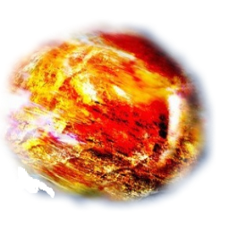
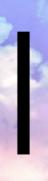
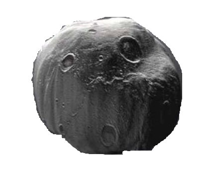
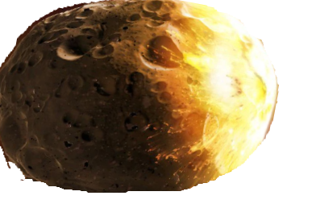
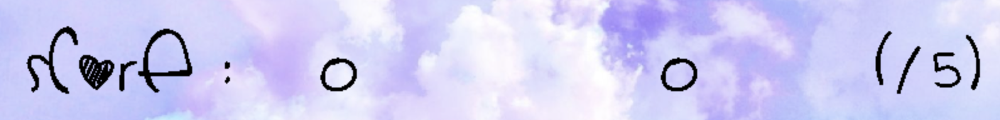
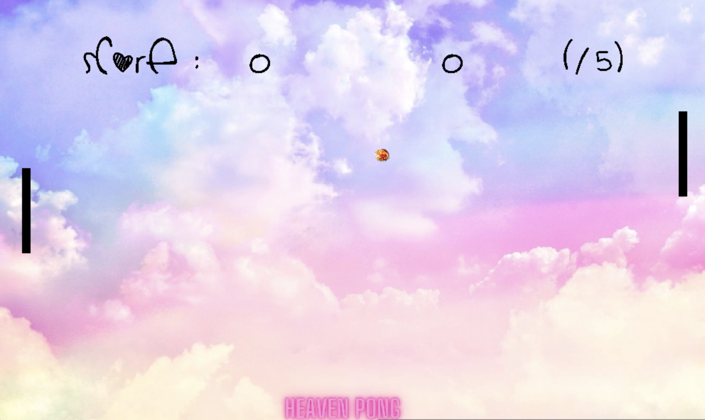
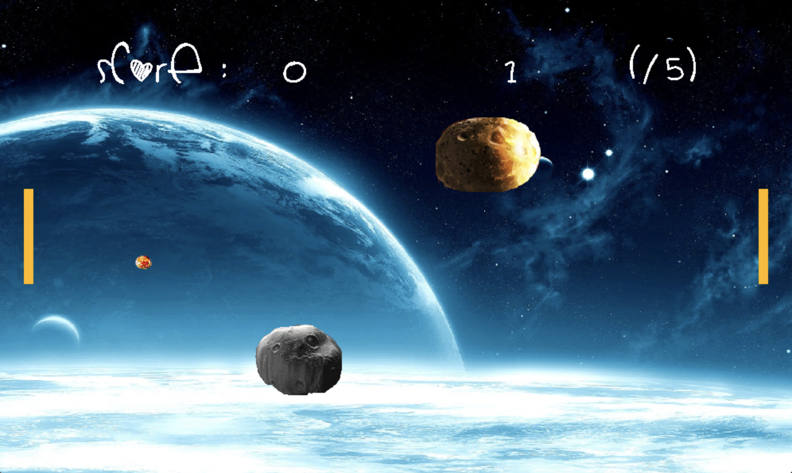
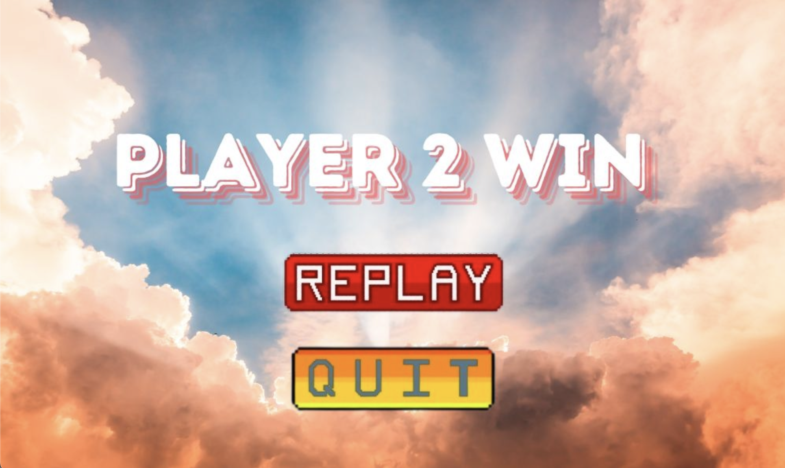
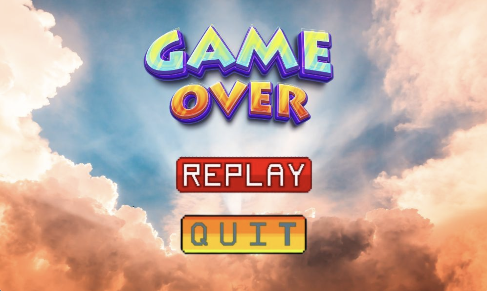

# HEAVEN PONG
- Họ Và Tên: Đặng Vũ Quỳnh Hương
- Mã sinh viên: 21020466 
- Video DEMO: [DEMO](https://drive.google.com/file/d/1tStPAcgXEDYkvaGmnXFfY8X1kcvvOq4I/view?usp=drive_link)

# Giới thiệu game

*SPECIAL PONG* là một game phát triển từ thể loại game Ping Pong truyền thống. Trong game, bạn sẽ tham gia vào các trận đấu bóng với chế độ 1 người chơi hoặc 2 người chơi. Mục tiêu là điều khiển thanh chắn để đỡ bóng và ghi điểm bằng cách làm bóng vượt qua đối phương. Trò chơi cung cấp hai cấp độ khó: EASY và HARD, với các không gian và thử thách khác nhau. Người chơi sẽ chiến thắng khi đạt 5 điểm trước.

- [0. Cách tải game](#0-cách-tải-game)
  * [a. Cách 1: Chơi game từ bản nén sẵn](#a-cách-1-chơi-game-từ-bản-nén-sẵn)
  * [b. Cách 2: Tải repo và tự biên dịch](#b-cách-2-tải-repo-và-tự-biên-dịch)
- [1. Bắt đầu game](#1-bắt-đầu-game)
- [2. Chọn level](#2-chọn-level)
- [3. Các thành phần trong game](#3-các-thành-phần-trong-game)
- [4. Cách chơi](#4-cách-chơi)
  * [a. Chế độ EASY](#a-chế-độ-easy)
  * [b. Chế độ HARD](#b-chế-độ-hard)
- [5. Chiến thắng và thất bại](#5-chiến-thắng-và-thất-bại)
- [Về đồ họa của game](#Về-đồ-họa-của-game)

- [Nguồn tham khảo](#Nguồn-tham-khảo)

- [Về source code của game](#Về-source-code-của-game)

- [Hướng phát triển](#Hướng-phát-triển)


# 0. Cách tải game

## a. Cách 1: Chơi game từ bản nén sẵn

### Windows:

- Tải game:
   - Tải tệp `.zip` từ [Heaven Pong - Releases](https://github.com/hgqh/Heaven_LTNC/releases/tag/v1.0).
   - Hoặc tải tệp `.tar.gz` nếu cần.
- Giải nén:
   - Giải nén tệp `.zip` hoặc `.tar.gz` vào một thư mục trên máy tính.
- Chạy game:
   - Sau khi giải nén, mở thư mục chứa trò chơi và tìm file `Heaven_LTNC.exe`.
   - Nhấp đúp vào `Heaven_LTNC.exe` để khởi chạy trò chơi.

### Linux/MacOS:

- Tải game:
   - Tương tự như trên Windows, tải tệp `.zip` hoặc `.tar.gz` từ link trên.
- Giải nén:
   - Giải nén tệp `.zip` hoặc `.tar.gz` vào một thư mục bất kỳ.
- Chạy game:
   - Mở Terminal.
   - Chuyển đến thư mục chứa trò chơi bằng lệnh `cd` (ví dụ: `cd ~/Downloads/Heaven_LTNC_v1.0/`).
   - Gõ lệnh sau để chạy game:
     ```bash
     ./Heaven_LTNC
     ```
   - **Lưu ý:** Cần cấp quyền thực thi cho tệp `Heaven_LTNC` bằng lệnh:
     ```bash
     chmod +x Heaven_LTNC
     ```

---

## b. Cách 2: Tải repo và tự biên dịch

### Windows:

- Clone repo:
   - Mở Terminal hoặc Git Bash, chạy lệnh sau để clone repo:
     ```bash
     git clone https://github.com/hgqh/Heaven_LTNC.git
     ```
   - Hoặc tải tệp `.zip` chứa mã nguồn từ GitHub và giải nén.
- Cài MinGW:
   - Tải và cài đặt MinGW-W64 phiên bản `GCC-8.1.0 x86_64-posix-seh` từ [MinGW-W64](https://sourceforge.net/projects/mingw-w64/).
   - Thêm đường dẫn của MinGW vào biến môi trường `PATH`.
- Cài đặt GNU Make:
   - Tải GNU Make từ [GNUWin32](http://gnuwin32.sourceforge.net/packages/make.htm) hoặc cài qua MinGW.
   - Thêm đường dẫn của GNU Make vào biến môi trường `PATH`.
- Biên dịch trò chơi:
   - Mở `cmd` hoặc Git Bash, di chuyển đến thư mục chứa `Makefile`.
   - Gõ lệnh `make` để biên dịch trò chơi:
     ```bash
     make
     ```
- Chạy game:
   - Sau khi biên dịch, file thực thi sẽ nằm trong thư mục `bin`. Chạy file này để chơi game.

### Linux/MacOS:

- Clone repo:
   - Mở Terminal, chạy lệnh sau để clone repo:
     ```bash
     git clone https://github.com/hgqh/Heaven_LTNC.git
     ```
   - Hoặc tải tệp `.zip` chứa mã nguồn từ GitHub và giải nén.
- Cài đặt GCC và các thư viện cần thiết:
   - Trên Ubuntu/Debian:
     ```bash
     sudo apt update
     sudo apt install g++ libsdl2-dev libsdl2-image-dev libsdl2-mixer-dev libsdl2-ttf-dev make
     ```
   - Trên macOS (sử dụng Homebrew):
     ```bash
     brew install sdl2 sdl2_image sdl2_mixer sdl2_ttf make
     ```
- Biên dịch trò chơi:
   - Mở Terminal và chuyển đến thư mục chứa `Makefile`.
   - Chạy lệnh sau để biên dịch trò chơi:
     ```bash
     make
     ```
- Chạy game:
   - Sau khi biên dịch, chạy tệp thực thi từ thư mục `bin`:
     ```bash
     ./bin/Heaven_LTNC
     ```

**Một số lưu ý:**

- **Windows:** Khi biên dịch trên Windows, có thể cần xóa các tệp `libgcc_s_seh-1.dll`, `libstdc++-6.dll`, và `libwinpthread-1.dll` nếu chúng xuất hiện trong thư mục chứa `Heaven_LTNC.exe`.
- **Linux/MacOS:** Đảm bảo đã cài đặt đầy đủ các thư viện SDL2 trước khi biên dịch trên Linux hoặc macOS.

# 1. Bắt đầu trò chơi
Đây là màn hình mở đầu của trò chơi *Heaven Pong*, với giao diện đơn giản và màu sắc dễ thương. Người chơi có hai tùy chọn: chọn độ khó (`Level`) và chế độ chơi (`Mode`).

<div style="text-align: center;">

  
</div>

# 2. Chọn độ khó
Người chơi có thể chọn giữa 2 mức độ khó: `EASY` và `HARD`, cùng với 2 chế độ chơi: `1 PLAYER` và `2 PLAYER`.

<div style="text-align: center;">

  
</div>

Khi click chuột chọn một độ khó và chế độ chơi, vùng đã chọn sẽ đổi sang màu đỏ, thể hiện sự xác nhận lựa chọn của người chơi.

<div style="text-align: center;">

  
</div>

Sau khi hoàn tất lựa chọn, nút `PLAY` sẽ xuất hiện trên màn hình menu. Người chơi chỉ cần click vào nút này để bắt đầu ván game.


# 3. Các thành phần trong game:
- **Pong (Bóng):** Người chơi có nhiệm vụ đỡ quả bóng này bằng cách điều khiển thanh chắn sao cho quả bóng không trượt qua phía mình và nảy sang phía đối phương.
<div style="text-align: center;">

  
</div>

- **Paddle (Thanh chắn):** Đây là thanh chắn được sử dụng để đỡ bóng và đánh bóng sang phía đối phương. Thanh chắn này chỉ có thể di chuyển lên và xuống trong quá trình chơi.
<div style="text-align: center;">

  
</div>

- **Obstacle (Chướng ngại vật):** Xuất hiện ở chế độ `HARD`. Chướng ngại vật nằm giữa sân, khi bóng đập vào bất kỳ điểm nào trên hai chướng ngại vật này, nó sẽ lập tức bật lại.
<div style="display: flex; justify-content: center;">

  
  
</div>

- **Scorebar (Thanh hiển thị điểm):** Hiển thị số điểm hiện tại của mỗi bên.
<div style="text-align: center;">

  
</div>


# 4. Cách chơi

## a. Chế độ EASY
- Ở chế độ `EASY` khi chơi đơn, người chơi sẽ điều khiển thanh chắn bằng phím mũi tên lên và xuống để đỡ bóng và làm bóng nảy lại về phía đối thủ. Nếu không đỡ được bóng, đối phương sẽ ghi điểm.
- Với chế độ 2 người chơi, người thứ nhất sử dụng phím `W` và `S` để di chuyển thanh chắn, còn người thứ hai sử dụng phím mũi tên lên và xuống. (Lưu ý: Để chơi chế độ 2 người, cần chuyển Unikey sang tiếng Anh.)
<div style="text-align: center;">

  
</div>

## b. Chế độ HARD
- Ở chế độ `HARD`, bản đồ sẽ chuyển thành không gian vũ trụ với các tiểu hành tinh làm chướng ngại vật. Khi bóng (thiên thạch) va vào chướng ngại vật, bóng sẽ bật ra theo các hướng khó đoán. Cách chơi tương tự cho cả chế độ 1 người và 2 người chơi.
<div style="text-align: center;">

  
</div>


# 5. Chiến thắng và thất bại

- Người chơi sẽ chiến thắng khi đạt đủ 5 điểm trước.

<div style="text-align: center;">

  
</div>

- Ngược lại, nếu không đạt được điều này, bạn sẽ thất bại.

<div style="text-align: center;">

  
</div>


### Về đồ họa của game:

- Tất cả hình ảnh trong game được em tự thiết kế trên [Canva](https://www.canva.com/), có thể xem chúng trong thư mục [Hình ảnh](assets/images).
- Âm thanh trong game được lấy từ nguồn [Mixkit](https://mixkit.co/free-sound-effects/game/) và được lưu trong thư mục [Âm thanh](assets/audio).
- Phông chữ sử dụng trong game được tải từ [itch.io](https://itch.io/) và có sẵn trong thư mục [Phông chữ](assets/fonts).


### Nguồn tham khảo
- Em tham khảo video: [Let's Make Pong w/ C++ & SDL2 ](https://www.youtube.com/watch?v=DeKfZhwyFO4&t=1715s) (Chỉ tham khảo phần code logic của game truyền thống, còn lại là tự phát triển).

- [Lazy Foo' Productions](https://lazyfoo.net/tutorials/SDL/index.php)


### Về source code của game:
#### Folder `assets`
- Folder `audio`: Chứa các tệp âm thanh sử dụng trong game, chẳng hạn như nhạc nền hoặc hiệu ứng âm thanh.
- Folder `fonts`: Chứa các font chữ được sử dụng trong game.
- Folder `images`:Chứa tất cả các hình ảnh sử dụng trong game (được phân loại theo danh mục).

#### Folder `src`
- File `object.h` và `object.cpp`
  * `object.h`
    + Cung cấp hàm để thiết lập vị trí, vùng hình ảnh, và tải hình ảnh từ tệp thành texture.
    + Hàm getter trả về dest, src, và tex.
  * object.cpp:
    + Hiện thực hóa hàm setDest, setSource, và setImage.
    + Giải phóng SDL_Surface sau khi tạo texture.

- File `menu.h` và `menu.cpp`
  * `menu.h`:
    - Quản lý `renderer`, `window`, `font`, `gnhacnen`, hiệu ứng âm thanh `gHigh`, và khu vực hiển thị điểm số `score_board`.
    - Cung cấp các hàm để vẽ đối tượng `draw`, hiển thị văn bản `write`, hiển thị menu `renderMenu`, xử lý đầu vào `inputmenu`, và điều khiển vòng lặp chính của menu `run`.
  * `menu.cpp`:
    - Hiện thực hóa các hàm để vẽ đối tượng, hiển thị văn bản, hiển thị menu, xử lý sự kiện từ người dùng, và điều khiển vòng lặp chính.

- `game.h` và `game.cpp`:
  * Khởi tạo và xử lý chính:
      + `Game() (constructor)`: Khởi tạo game, khởi tạo window và renderer, âm thanh, phông chữ, và tải các tài nguyên game.
      + `~Game() (destructor)`: Giải phóng tài nguyên khi game kết thúc.
      + `loadAssets(`): Tải hình ảnh và tài nguyên game như hình nền, đối tượng, và các yếu tố giao diện.
  * Xử lý logic game:
      + `variable()`: Khởi tạo các biến cần thiết cho logic game.
      + `serve()`: Khởi động lại vị trí của bóng khi bắt đầu hoặc sau khi ghi điểm.
      + `update()`: Cập nhật trạng thái game trong mỗi khung hình.
      + `inputgame()`: Xử lý các đầu vào từ người chơi trong quá trình game.
      + `rungame()`: Chạy vòng lặp chính của game.
      + `runback()`: Xử lý các trạng thái quay lại trong game.
  * Giao diện người dùng và xử lý menu:
      + `draw(Object o)`: Vẽ các đối tượng lên màn hình.
      + `renderMenu()`: Hiển thị giao diện menu.
      + `inputMenu()`: Xử lý các đầu vào từ người chơi trong giao diện menu.
      + `runMenu()`: Vòng lặp để chạy giao diện menu.
      + `rendergame()`: Vẽ giao diện game trong quá trình chơi.
      + `write(std::string text, int x, int y, int r, int g, int b, int size)`: Hiển thị văn bản lên màn hình.
      + `displayMenuOptions()`: Hiển thị các tùy chọn trong menu.
  * Quản lý tương tác:
      + `handlePaddleCollision()`: Xử lý va chạm giữa bóng và paddle.
      + `calculateBounce(const SDL_Rect& paddle)`: Tính toán góc bật lại của bóng khi va chạm với paddle.
      + `handleBallPosition()`: Kiểm tra và xử lý vị trí của bóng trong game.
      + `handleMouseClick(SDL_Event& e)`: Xử lý các click chuột của người chơi trong game.
      + `manageFrameRate()`: Quản lý tốc độ khung hình để đảm bảo game chạy mượt mà.

### Hướng phát triển

- Thêm chế độ chơi 2 người với một người điều khiển bằng chuột và một người điều khiển bằng bàn phím.
- Mở rộng các mức độ khó, thêm chướng ngại vật mới như máy bắn đạn ở giữa sân, yêu cầu người chơi vừa đỡ bóng vừa né đạn để không bị mất mạng.
- Bổ sung nhiều tùy chọn về hình nền của game, cùng với các chế độ đa dạng hơn cho quả bóng.
